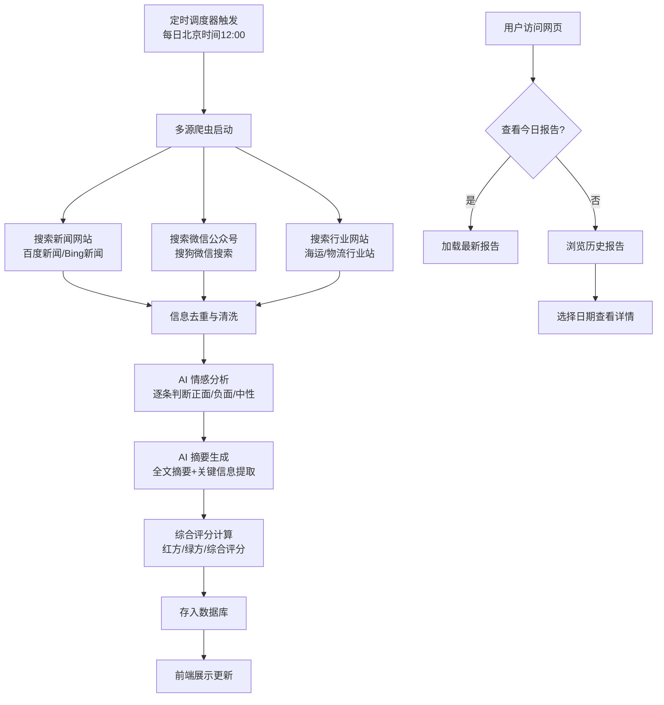

## 1. 产品概述

"海南中远海运集装箱运输有限公司"舆情监控系统 —— 每日自动从新闻网站、行业网站、微信公众号等多渠道搜索该公司相关信息，通过 AI 情感分析生成正面（红方）/负面（绿方）评价及综合评分，以商务科技风格网页展示，支持历史记录回溯。

- 目标用户：公司管理层、公关团队，需要快速了解公司舆情动态
- 核心价值：自动化信息搜集与智能分析，省去人工搜索与判断，每日定时更新提供决策参考

## 2. 核心功能

### 2.1 功能模块

1. **今日报告页（首页）**：当日信息摘要、新闻列表、红绿方分析、综合评分仪表盘
2. **历史报告页**：按日期浏览过往报告，点击查看详情

### 2.2 页面详情

| 页面名称 | 模块名称 | 功能描述 |
|----------|----------|----------|
| 今日报告 | 顶部状态栏 | 显示报告日期、更新时间、信息条数、数据来源数 |
| 今日报告 | 信息摘要区 | 当日所有信息的 AI 综合摘要（2-3 段），关键信息高亮 |
| 今日报告 | 新闻列表 | 每条信息卡片：标题、来源标签（新闻/公众号/行业）、摘要、情感标签（正面/负面/中性）、原文链接、发布时间 |
| 今日报告 | 红方分析（正面） | 正面信息汇总、正面得分、正面观点提炼、支撑信息条数 |
| 今日报告 | 绿方分析（负面） | 负面信息汇总、负面得分、负面观点提炼、支撑信息条数 |
| 今日报告 | 综合评分 | 0-100 分仪表盘、评级（优/良/中/差）、综合评语 |
| 历史报告 | 日期列表 | 按时间倒序排列的历史报告卡片（日期、评分、信息条数、简要摘要） |
| 历史报告 | 报告详情 | 点击某日卡片，展开该日完整报告内容（同今日报告布局） |

## 3. 核心流程

## 4. 用户界面设计

### 4.1 设计风格

- **主题**：深色科技商务风（Dark Mode），以深海蓝（#0A1628）为底色，配合青蓝色（#00D4FF）和电光蓝（#3B82F6）作为科技感强调色
- **红方色**：珊瑚红（#FF4757）—— 正面评价
- **绿方色**：翠绿色（#2ED573）—— 负面评价
- **字体**：标题使用 Orbitron（科技感等宽字体），正文使用 Noto Sans SC（中文无衬线）
- **布局**：卡片式布局，顶部导航栏，内容区左右分栏（桌面端）
- **动效**：数据加载时骨架屏，评分仪表盘动画，卡片悬浮微交互，页面切换过渡
- **背景**：网格纹理 + 径向渐变光晕，营造数据监控中心氛围

### 4.2 页面设计概览

| 页面名称 | 模块名称 | UI 元素 |
|----------|----------|---------|
| 今日报告 | 顶部导航 | 深色半透明导航栏，Logo + 标题 + 日期切换按钮 + 历史/今日切换 |
| 今日报告 | 状态栏 | 4 个数据卡片（日期、更新时间、信息数、来源数），图标+数字，青色发光边框 |
| 今日报告 | 摘要区 | 大卡片，深色玻璃态背景，左侧蓝色竖线装饰，摘要文字，关键信息标签 |
| 今日报告 | 新闻列表 | 可滚动卡片列表，每张卡片含来源标签（彩色圆角标签）、标题、摘要、情感指示灯（红/绿/灰圆点）、时间 |
| 今日报告 | 红方分析 | 左侧大卡片，红色主题渐变背景，正面得分（大数字）、评级条、正面观点列表 |
| 今日报告 | 绿方分析 | 右侧大卡片，绿色主题渐变背景，负面得分（大数字）、评级条、负面观点列表 |
| 今日报告 | 综合评分 | 底部全宽卡片，半圆形仪表盘（SVG动画）、评级文字、综合评语 |
| 历史报告 | 历史列表 | 日期倒序卡片网格，每卡显示日期、评分色块、信息条数、摘要预览 |

### 4.3 响应式设计

- 桌面端（≥1024px）：左右分栏布局，新闻列表与分析并排
- 平板端（768-1023px）：上下堆叠，分析区域并排
- 移动端（<768px）：完全堆叠，卡片全宽，导航栏简化为底部 Tab
