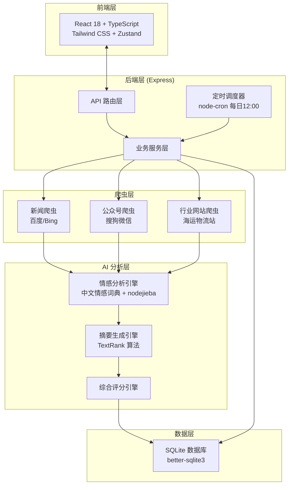
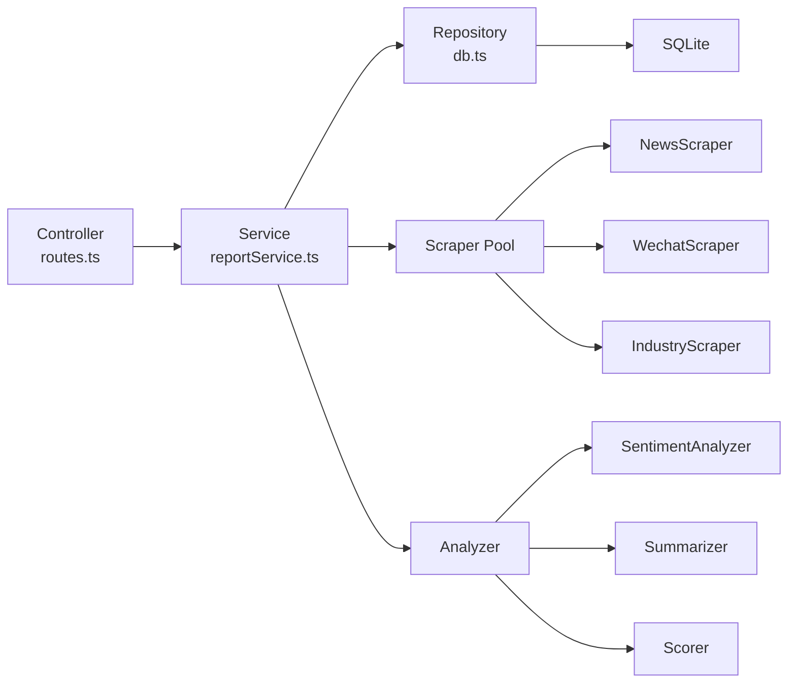
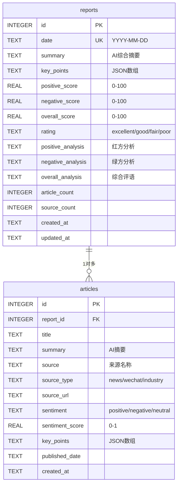

## 1. 架构设计



## 2. 技术说明

- **前端**：React@18 + TypeScript + Tailwind CSS@3 + Zustand + Vite
- **初始化工具**：vite-init (react-express-ts 模板)
- **后端**：Express@4 + TypeScript (ESM)
- **数据库**：SQLite (better-sqlite3)，文件型数据库，无需安装额外服务
- **爬虫**：axios + cheerio（HTML 解析）+ iconv-lite（编码转换）
- **中文 NLP**：nodejieba（中文分词）+ 自建情感词典（正面/负面词汇库）
- **摘要算法**：TextRank 提取式摘要
- **定时调度**：node-cron（cron 表达式 `0 4 * * *`，UTC 04:00 = 北京时间 12:00）
- **包管理**：npm

## 3. 路由定义

| 路由 | 用途 |
|------|------|
| `/` | 今日报告页（首页） |
| `/history` | 历史报告列表页 |
| `/history/:date` | 指定日期报告详情页 |

## 4. API 定义

### 4.1 获取今日报告
```
GET /api/reports/today
```
响应：
```typescript
interface ReportResponse {
  id: number;
  date: string;              // YYYY-MM-DD
  updatedAt: string;         // ISO timestamp
  articleCount: number;
  sourceCount: number;
  summary: string;           // AI 综合摘要
  keyPoints: string[];       // 关键信息列表
  positiveScore: number;     // 0-100
  negativeScore: number;     // 0-100
  overallScore: number;      // 0-100
  rating: 'excellent' | 'good' | 'fair' | 'poor';
  positiveAnalysis: string;  // 红方分析
  negativeAnalysis: string;  // 绿方分析
  overallAnalysis: string;   // 综合评语
  articles: Article[];
}

interface Article {
  id: number;
  title: string;
  summary: string;
  source: string;            // 来源名称
  sourceType: 'news' | 'wechat' | 'industry';
  sourceUrl: string;
  sentiment: 'positive' | 'negative' | 'neutral';
  sentimentScore: number;    // 0-1
  keyPoints: string[];
  publishedDate: string;
}
```

### 4.2 获取历史报告列表
```
GET /api/reports/history?page=1&limit=20
```
响应：
```typescript
interface HistoryResponse {
  total: number;
  page: number;
  limit: number;
  reports: HistoryItem[];
}

interface HistoryItem {
  id: number;
  date: string;
  overallScore: number;
  rating: string;
  articleCount: number;
  summary: string;           // 截断的摘要预览
}
```

### 4.3 获取指定日期报告
```
GET /api/reports/:date       // date format: YYYY-MM-DD
```
响应：同 `ReportResponse`

### 4.4 手动触发更新
```
POST /api/reports/refresh
```
响应：
```typescript
interface RefreshResponse {
  success: boolean;
  message: string;
  articleCount?: number;
}
```

## 5. 服务架构图



## 6. 数据模型

### 6.1 数据模型定义



### 6.2 数据定义语言 (DDL)

```sql
CREATE TABLE IF NOT EXISTS reports (
    id INTEGER PRIMARY KEY AUTOINCREMENT,
    date TEXT UNIQUE NOT NULL,
    summary TEXT,
    key_points TEXT DEFAULT '[]',
    positive_score REAL DEFAULT 0,
    negative_score REAL DEFAULT 0,
    overall_score REAL DEFAULT 0,
    rating TEXT DEFAULT 'fair',
    positive_analysis TEXT,
    negative_analysis TEXT,
    overall_analysis TEXT,
    article_count INTEGER DEFAULT 0,
    source_count INTEGER DEFAULT 0,
    created_at TEXT DEFAULT (datetime('now')),
    updated_at TEXT DEFAULT (datetime('now'))
);

CREATE TABLE IF NOT EXISTS articles (
    id INTEGER PRIMARY KEY AUTOINCREMENT,
    report_id INTEGER NOT NULL,
    title TEXT NOT NULL,
    summary TEXT,
    source TEXT,
    source_type TEXT,
    source_url TEXT,
    sentiment TEXT DEFAULT 'neutral',
    sentiment_score REAL DEFAULT 0.5,
    key_points TEXT DEFAULT '[]',
    published_date TEXT,
    created_at TEXT DEFAULT (datetime('now')),
    FOREIGN KEY (report_id) REFERENCES reports(id) ON DELETE CASCADE
);

CREATE INDEX IF NOT EXISTS idx_articles_report_id ON articles(report_id);
CREATE INDEX IF NOT EXISTS idx_reports_date ON reports(date);
```
